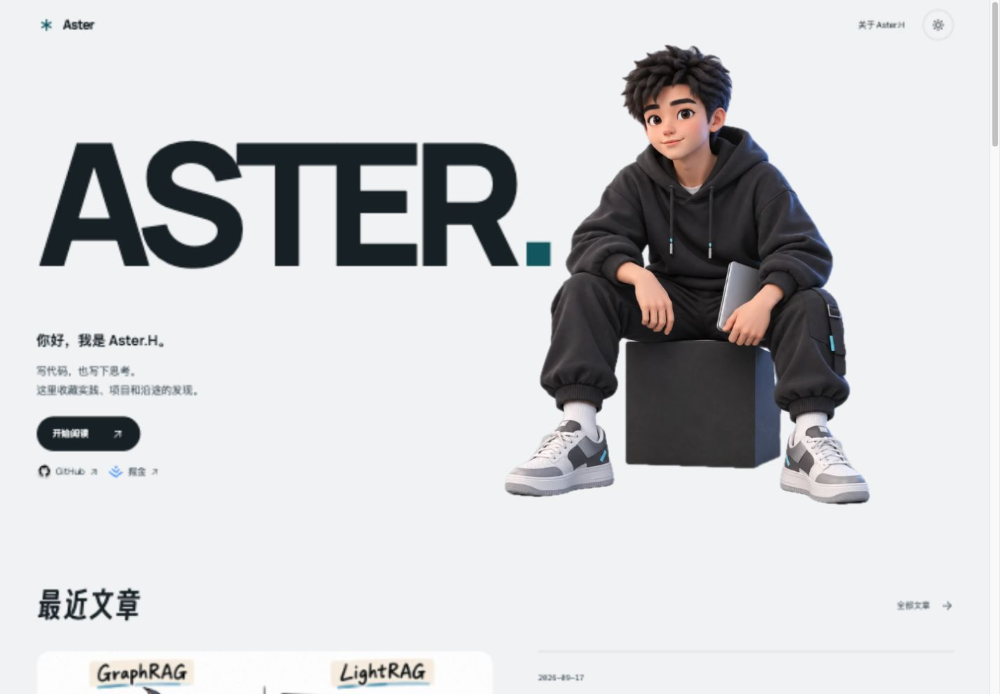
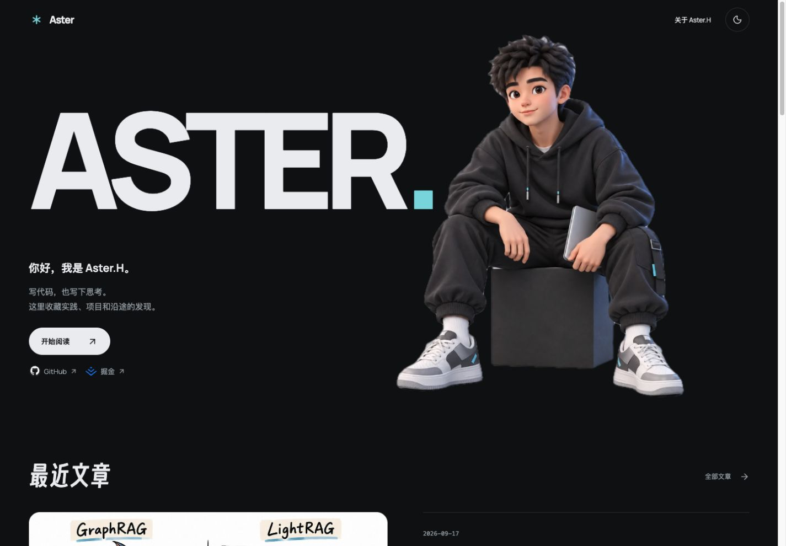
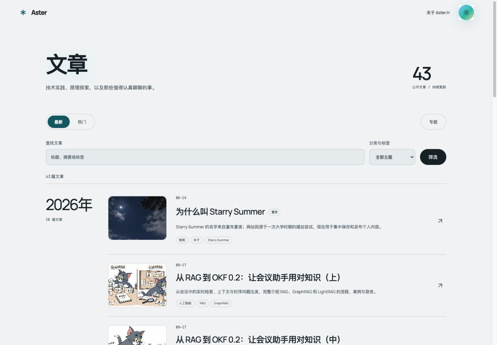
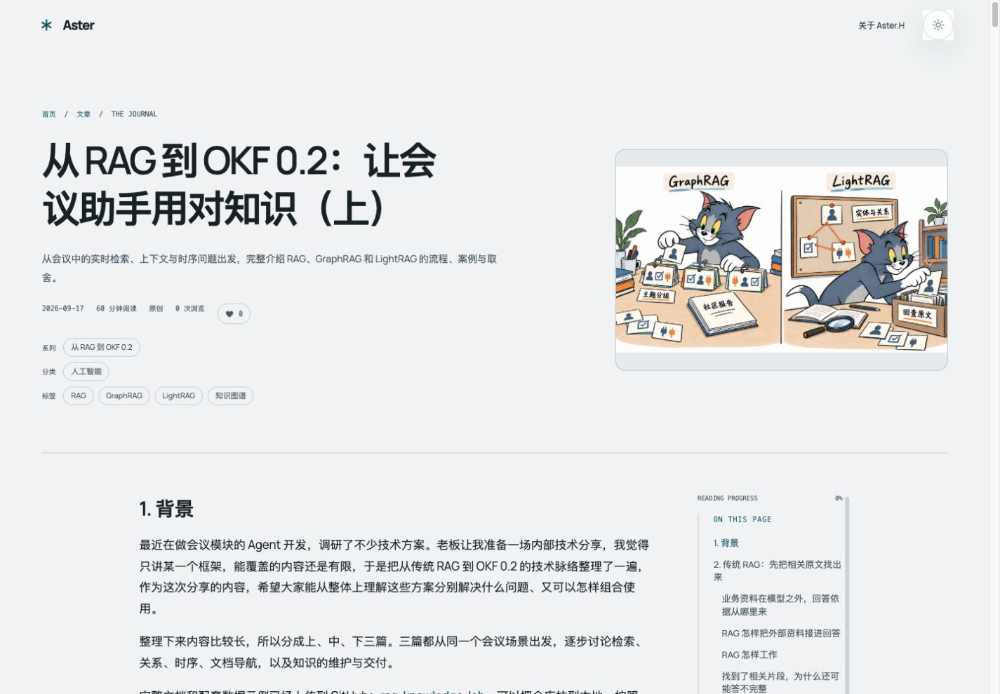
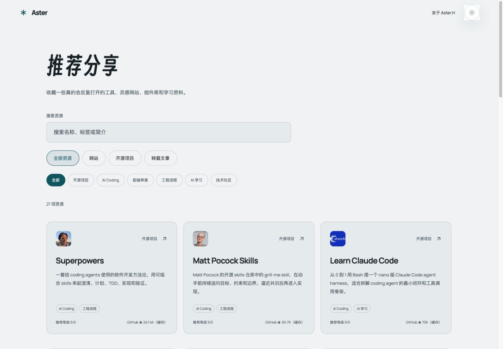

# Aster

Aster 是 Aster.H 的个人博客，记录技术、项目与日常，也收集值得再打开的网站、开源项目和学习资料。

[访问网站](https://www.asterh.me/) · [GitHub 仓库](https://github.com/HuangJingwang/aster)

代码、文章、配置和素材保存在同一个仓库，通过 Git 管理版本并由 Vercel 部署。首页用 Aster 字标和卡通形象呈现个人介绍，向下浏览最近文章、个人项目和推荐资源。公开页面支持明暗主题，移动端提供顶部快捷导航，文章页提供目录和阅读进度。

首页构图与交互参考了 [MotionSites](https://motionsites.ai/?prompt=3d-jack-portfolio-hero) 和 [React Bits Dock](https://reactbits.dev/components/dock)。早期布局参考了 [yysuni.com](https://www.yysuni.com/) 及其开源项目 [YYsuni/2025-blog-public](https://github.com/YYsuni/2025-blog-public)。

## 预览

以下截图采集自 [在线站点](https://www.asterh.me/)，更新于 2026 年 10 月 6 日（Asia/Shanghai），桌面视口为 1440 × 1000。页面内容会随发布继续更新。

首页白天主题：



首页夜间主题：



文章列表，按年份浏览，支持最新／热门排序、搜索和分类标签筛选：



文章阅读页，包含封面、分类标签、阅读进度与章节目录：



推荐分享，收藏网站、开源项目和学习资料：



## 项目定位

Aster 按单人维护的方式组织内容：

- 公开站点负责阅读体验、搜索、归档、RSS、推荐分享、刷题日记、留言和轻互动。
- 仓库保留中文后台界面；默认静态模式通过仓库文件维护和发布内容，不开放后台写入。
- 内容、配置和小型素材优先落在仓库中，方便审阅、备份、迁移和回滚。
- GitHub 保存代码与内容，Vercel 负责部署，必要的互动数据可以接入 Worker/KV/D1。
- 两套公开主题并存：白天采用浅灰底色与深色文字，夜间采用近黑底色与浅色文字，以青色点缀。

项目原名 Starry Summer，现用名称为 Aster，GitHub 仓库为 `HuangJingwang/aster`。内部 npm 包名、备份目录前缀和历史文章中的旧名保留，避免改名影响已有命令和内容链接。

## 当前能力

- 内容展示：文章、笔记、项目记录；推荐分享页收藏网站、开源项目和学习资料。
- 内容组织：分类、标签、专题、归档、搜索和 RSS；文章列表支持按年份浏览、最新／热门排序、筛选和分页。
- 阅读体验：Markdown 正文、代码与插图、章节目录、阅读进度、相邻文章和明暗主题。
- 公开互动：保留留言板、评论、点赞和浏览量接口；运行时互动需要配置独立 Worker，默认仓库内容仍可直接阅读。
- 后台界面：中文内容工作台、Markdown 草稿编辑与预览、素材管理组件；默认静态模式禁用在线写入，发布通过 Git 提交完成。
- 刷题日记：LeetCode 仪表盘、每日推荐、今日任务、复习轮次和题目笔记。
- 内容工具：内容文件、站点设置和素材索引随 Git 管理，提供掘金文章导入与 LeetCode 数据同步脚本。
- 运维工具：备份、恢复、健康检查、生产 smoke、部署反馈跟踪。

## 架构

Aster 采用仓库驱动的内容管理方式：


```text
apps/
  web/                 Next.js public site, admin UI, route handlers
  web/content/         repository-backed public content and settings
  web/public/          images and static assets
packages/
  shared/              shared domain types and helpers
  markdown/            Markdown parsing and rendering helpers
workers/
  interactions-worker/ optional hosted interaction worker
scripts/               env, smoke, backup, restore, hygiene checks
docs/                  deployment, security, migration notes, screenshots
```

主要内容入口：

```text
apps/web/content/public-content.json
apps/web/content/site-settings.json
apps/web/content/assets.json
apps/web/content/leetcode/dashboard.json
apps/web/public/images/**
```

## 技术栈

- Web：Next.js 16（App Router）、React 19、TypeScript
- 内容：JSON、Markdown、仓库文件
- UI：CSS 主题变量、Framer Motion 动效、Lucide 图标、中文后台界面
- 工作区：npm workspaces
- 内部包：`@starry-summer/shared`、`@starry-summer/markdown`
- 部署与运维：Vercel、GitHub、Shell 检查脚本，可选 Cloudflare Worker

## 本地运行

需要：

- Node.js 22+
- npm 10+

克隆仓库并安装依赖：

```bash
git clone https://github.com/HuangJingwang/aster.git
cd aster
npm install
```

已有本地仓库只需更新远程地址，不必重命名本地目录：

```bash
git remote set-url origin git@github.com:HuangJingwang/aster.git
```

启动 Web：

```bash
npm run dev:web
```

默认地址：

```text
http://127.0.0.1:3000
```

常用检查：

```bash
npm test
npm run typecheck
npm run build
```

内容更新入口：

- 文章与笔记：`apps/web/content/public-content.json`，正文保存在记录的 `bodyMarkdown` 字段中。
- 站点与社交设置：`apps/web/content/site-settings.json`。
- 推荐资源：`apps/web/src/lib/recommended-shares.ts`。
- 刷题数据：`apps/web/content/leetcode/dashboard.json`，可通过 `npm run sync:leetcode` 同步。
- 掘金导入：`npm run import:juejin -- --dry-run` 预览待导入文章，确认后运行 `npm run import:juejin`；可加 `--download-images` 将图片保存到仓库。

修改后运行相关检查，提交并推送，由 Vercel 重新构建发布。

## 配置

默认静态站模式不需要后台账号密码，也不需要在 Vercel 中保存 GitHub 内容写入 token。内容和设置通过仓库文件维护，提交后由部署流程发布。

如果启用互动 Worker，可以生成互动签名密钥：

```bash
npm run auth:interaction-secret
```

生产环境变量：

```text
PUBLIC_SITE_URL=https://your-domain.example
INTERACTION_HASH_SECRET=generated-interaction-secret # 可选，仅互动 Worker 需要
```

互动服务地址通过 `NEXT_PUBLIC_INTERACTION_BASE_URL`（浏览器）和 `INTERACTION_BASE_URL`（服务端）配置。Worker 当前保留基础实现，接入前请阅读 [Worker 说明](workers/interactions-worker/README.md)。

更多配置见 [部署说明](docs/deployment.md) 和 [安全说明](docs/security.md)。

## 部署

默认生产路线是 GitHub + Vercel + 自定义域名：


Vercel 项目建议：

```text
Root Directory: apps/web
Install Command: cd ../.. && npm ci
Build Command: cd ../.. && npm run build
Output Directory: Next.js default
```

这里需要 `cd ../..`，因为 Vercel 进入 `apps/web` 后，要回到仓库根目录安装依赖并构建 workspace。

部署后可以检查：

```text
https://your-domain.example
https://your-domain.example/health
https://your-domain.example/admin/content
```

或运行：

```bash
npm run ops:smoke -- https://your-domain.example
```

## 备份与恢复

备份静态内容和图片：

```bash
npm run ops:backup
```

恢复时需要显式确认：

```bash
RESTORE_CONFIRM=YES npm run ops:restore -- backups/starry-summer-static-YYYY-MM-DD
```

本地健康检查：

```bash
npm run ops:doctor
npm run ops:smoke
```

## Codex post-push watcher

这个仓库带有一套本地 **Codex post-push watcher**：当 Codex 执行 `git push` 后，本地 hook 会短暂启动 watcher，通过 `gh` 跟踪 GitHub checks、PR 状态和 Vercel 部署结果，并把状态写入 `.codex/local/post-push-status.jsonl`。

它的目标是保留本地可见的部署反馈，不依赖常驻任务，也不要求在 GitHub Actions 中配置 OpenAI API key。说明见 [docs/ops/codex-post-push-watcher.md](docs/ops/codex-post-push-watcher.md)。

## 相关文档

- [部署说明](docs/deployment.md)
- [安全说明](docs/security.md)
- [静态托管迁移记录](docs/static-hosting-migration.md)
- [Codex post-push watcher](docs/ops/codex-post-push-watcher.md)
